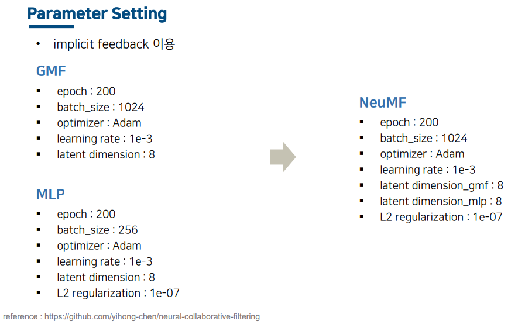

# 2022-2_Database_Team_Project
2022-2) 데이터베이스 과목 팀 프로젝트 [NeuMF]

## 1. 연구 배경

## 2. Paper Review

[**Neural Collaborative Filtering(2017)**](https://dl.acm.org/doi/pdf/10.1145/3038912.3052569)

- GroupLens Research에서 MovieLens의 등급 dataset을 수집해서 제공한 자료로 추천시스템을 평가할 때 자주 사용됨.
- 3,706편의 영화에서 6,040명의 사용자로부터 약 1,000,000 개의 평가(1점에서 5점)가 포함되어 있음.

## 4. 논문 구현

## 5. 구현 결과

## 6. 비교 실험

## 7. 결 론

